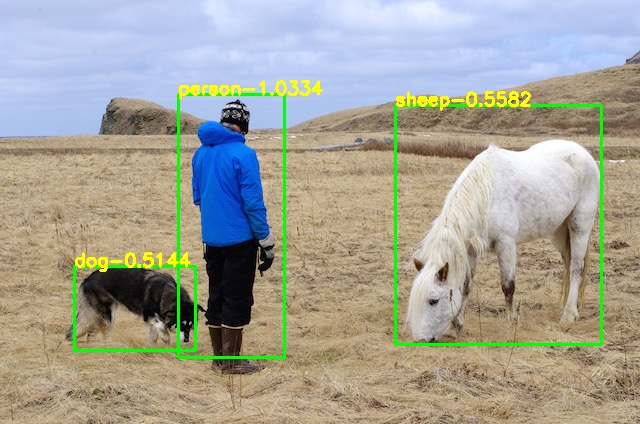
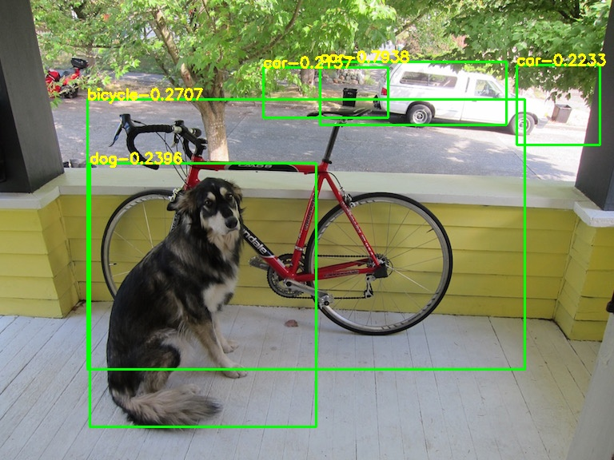
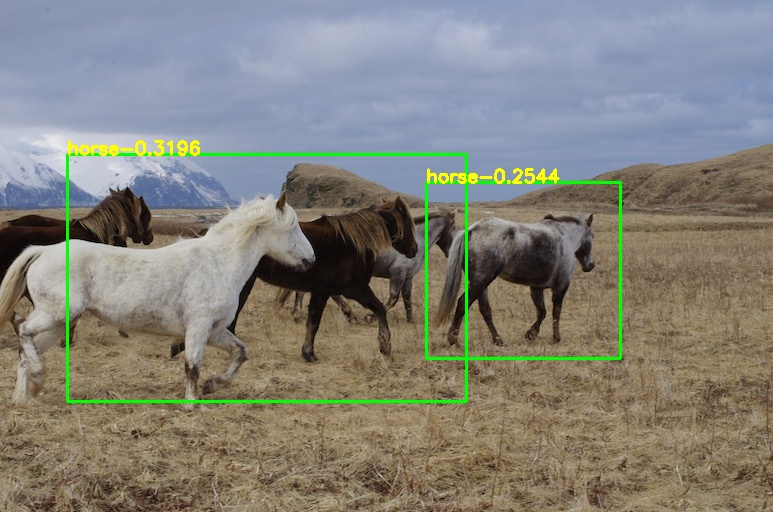
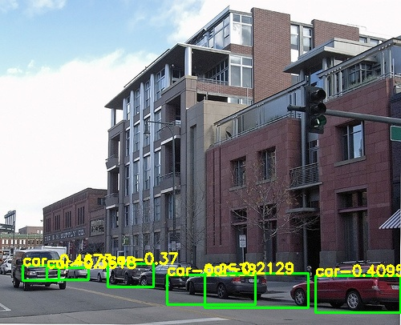

# YOLOV1_PyTorch_Train
PyTorch完美复现YOLOV1的精度和速度，配置完全相同，两者模型可以无障碍相互转换。

## 指标展示
|Model| train | test | mAP | FPS |
|-----|------|------|-----|-----|
|yolov1-tiny(paper) | 0712 |	2007_test |	52.7 |	155 |
|yolov1-tiny(retrain from darknet) | 0712 |	2007_test |	51.2 |	155 |
|**yolov1-tiny(ours)** | 0712 |	2007_test |	**52.1** |	**155** |

## 效果展示
      
      

## 使用说明
### 要求
> Python >= 3.6 \
> PyTorch >= 1.4
### 数据集下载
```shell script
cd <path-to-voc>/
wget https://pjreddie.com/media/files/VOCtrainval_11-May-2012.tar
wget https://pjreddie.com/media/files/VOCtrainval_06-Nov-2007.tar
wget https://pjreddie.com/media/files/VOCtest_06-Nov-2007.tar
tar xf VOCtrainval_11-May-2012.tar
tar xf VOCtrainval_06-Nov-2007.tar
tar xf VOCtest_06-Nov-2007.tar
```
### 数据生成
```shell script
cd data/voc0712
python voc_label.py
cat 2007_train.txt 2007_val.txt 2012_*.txt > train.txt
```
### 预训练模型下载
```shell script
cd pretrain
wget https://pjreddie.com/media/files/darknet.weights
```
### 训练和测试
```shell script
python train.py
```
已训练好的模型：[百度云(提取码:8888)](https://pan.baidu.com/s/1xDWUi5Vwiwnf3VMFjpla_g)
```shell script
python detect.py
```
### 计算mAP
模型转换至darknet
```shell script
python cvt2darknet.py
```
编译原始版本[darknet](https://github.com/pjreddie/darknet)
```shell script
./darknet yolo valid cfg/yolov1-tiny.cfg weights/yolov1-tiny-final.weights
```
将生成的`results`文件夹移入`eval`文件夹
```shell script
python voc_eval.py
```

## 复现重点
- `ours`采用`adam`优化器，而`darknet`采用`sgd`
- 完全复现`darknet`的数据增强方式：`crop`(并非传统意义的数据裁剪)
- 完全复现`darknet`的`loss`计算方式
  <br>1. 有目标的两个预测`bbox`，`iou`最大或 **`rmse`最小** 的用于正样本反馈，反之用于负样本反馈
  <br>2. 计算两边框`iou`时，需要将预测边框的`w`和`h`分别`pow`，用以对应样本边框
  <br>**3. `darknet`采用的`coord_scale`和`noobject_scale`并非论文所说的`5`和`0.5`，而是`5x5`和`0.5x0.5`**
  <br>**4. `darknet`在计算`wh_loss`时，预测的`wh`并没有`sqrt`，而是将样本的`wh`进行了`sqrt`，因为检测时`wh`需要`pow`，所以在`fc`后并不需要添加`sigmoid`**

## 参考
https://blog.csdn.net/samylee  
https://pjreddie.com/darknet/yolov1  
https://github.com/pjreddie/darknet
